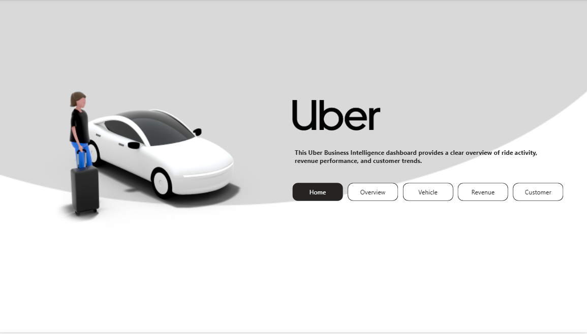
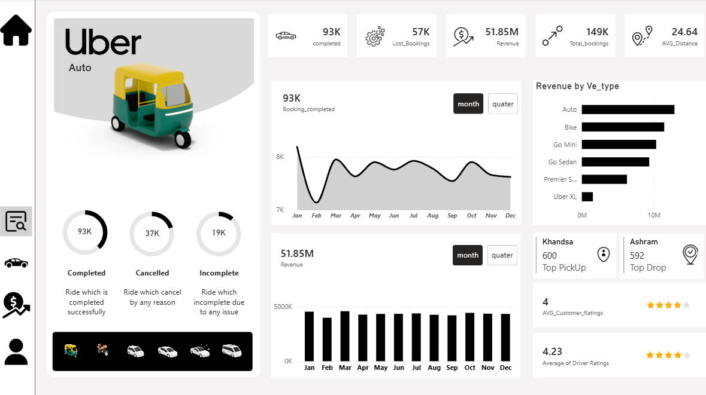
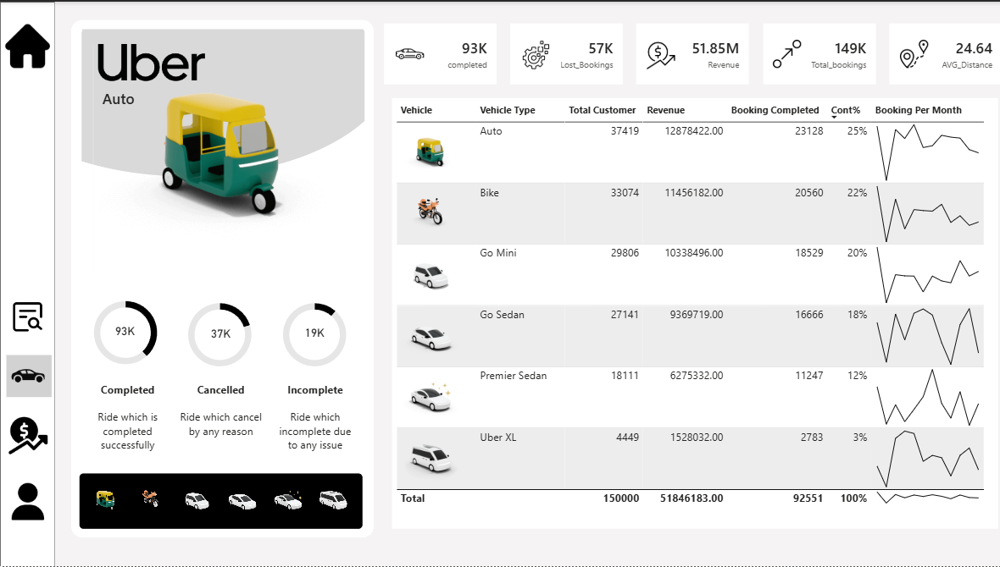
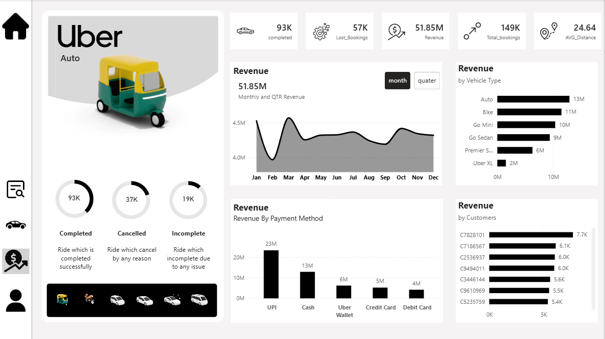
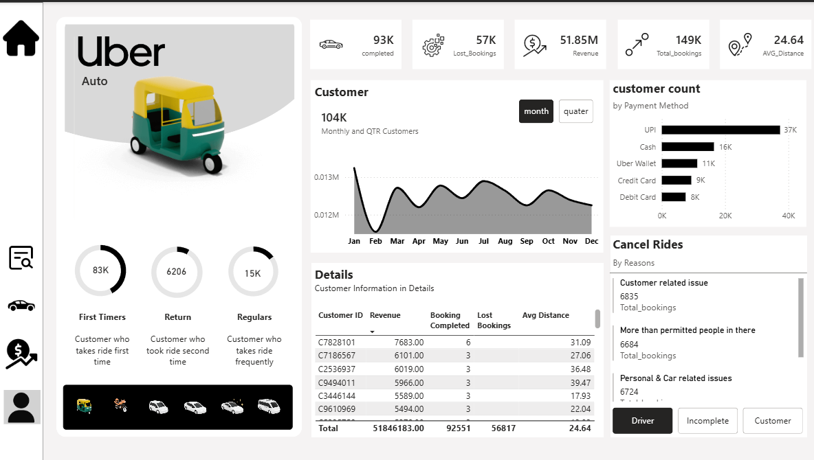

# Uber-BI-Dashboard
Power BI dashboard analyzing Uber ride data

## 📌 Project Overview

This project showcases an interactive Business Intelligence dashboard developed with Power BI to visualize Uber ride data.  
The dashboard offers insights into bookings, revenue, vehicle performance, customer behavior, and cancellation trends.

The objective of this project is to derive valuable business insights from the raw ride data using data modeling and DAX.

## 📊 Key Metrics

- 📍 Total Bookings: 149K
- ✅ Completed Rides: 93K
- 💰 Total Revenue: 51.85M
- 📏 Average Distance: 24.64 km
- ❌ Cancelled / Lost Bookings: 57K

## 📂 Dashboard Pages
### Overview Analysis
- Booking trends over time
- Ride volume analysis
- Overall performance analysis

### Vehicle Type Analysis
- Revenue analysis by vehicle type
- Booking contribution percentage
- Most profitable vehicle types

### Revenue Analysis
- Monthly revenue analysis
- Payment method distribution
- Revenue distribution patterns

### Customer Analysis
- Customer booking behavior
- Cancellation reasons
- Ratings & satisfaction analysis

## 🛠 Tools & Technologies Used
- Power BI
- DAX (Data Analysis Expressions)
- Data Modeling
- Data Cleaning
- Interactive Visualizations

## 📸 Dashboard Preview

## 🎯 Project Objective

To demonstrate strong data analysis, visualization, and business intelligence skills by building a real-world dashboard capable of supporting decision-making.

## 📁 Files Included

- (PowerBI/Uber_Dashboard.pbix)
- Dashboard Screenshots
- README.md
